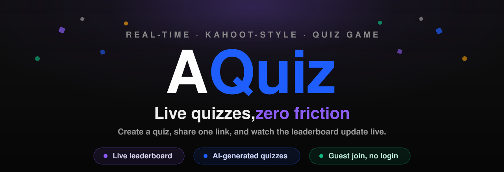

<div align="center">

<a href="https://azyquiz.vercel.app">
  
</a>

<br />
<br />

### A real-time, Kahoot-style quiz game you can host in seconds.

Create a quiz (or let AI write one), share a link, and watch players battle it out on a **live leaderboard** — complete with countdown timers, streak fires, confetti, and a champion podium for the winner.

<br />

[](https://azyquiz.vercel.app)


</div>

---

## ✨ Features

### 🎮 Play
- **Join in one tap** — players enter a 6-digit game code or open a share link. No download, no account required.
- **Guest mode** — jump in with just a nickname; guests are clearly badged everywhere.
- **Live race leaderboard** — rows slide up and down in real time as scores land, flashing green on every gain.
- **Speed-based scoring** — faster correct answers score higher: `round(points × remainingTime ÷ totalTime)`.
- **Streaks & celebrations** — a fire streak for consecutive correct answers, confetti on wins, and a crowned **champion podium** wearing the winner's avatar.
- **Runs itself** — auto-advances between questions with a synced countdown on every screen; the host can skip ahead any time.

### 🛠️ Create
- **Fast quiz builder** — multiple-choice questions, per-question timers and points, one-click correct-answer picker.
- **🤖 AI generation** — type a topic (*"Animals"*, *"Philippine history"*, *"90s music"*), pick a count and difficulty, and Gemini writes a full quiz you can edit before saving.
- **CSV import** — bring questions from Excel or Google Sheets; a downloadable template shows the exact format.
- **Host live** — every quiz gets a unique code and shareable link; you control pacing and watch players join in real time.

### 🎨 Polish
- Custom **AQuiz** brand and favicon, unique auto-generated avatar per player.
- Sleek **dark theme** with subtle depth, hairline card borders, and smooth press feedback.
- **Fully responsive** — built for phones first, since that's where players tap.
- Custom vector icons throughout (no emoji in the UI), honest empty/loading/error states, and a branded 404 page.

---

## 🧱 Tech stack

| Layer      | Choice                                                     |
| ---------- | ---------------------------------------------------------- |
| Frontend   | **Next.js 15** (App Router) · **React 19** · **TypeScript** |
| Styling    | **Tailwind CSS v4**                                        |
| Backend    | **Next.js API routes** + **Supabase**                     |
| Database   | **Supabase Postgres** (with Row Level Security)           |
| Realtime   | **Supabase Realtime** (postgres_changes + poll fallback)  |
| Auth       | **Supabase Auth** — email/password · Google OAuth · guest |
| AI         | **Google Gemini** (2.5 Flash, free tier)                  |
| Hosting    | **Vercel**                                                |

---

## 🚀 Getting started

### 1. Create a Supabase project

1. Go to [supabase.com](https://supabase.com) and create a project.
2. Open the **SQL Editor** and run the contents of
   [`supabase/migrations/001_init.sql`](supabase/migrations/001_init.sql) — this creates every table, the security policies, and the realtime setup.
3. *(Optional — Google login)* Under **Authentication → Sign In / Providers → Google**, enable it and paste your Google OAuth client ID + secret. Add `http://localhost:3000/auth/callback` (and your production URL) to the redirect allowlist.
4. *(Optional — easier testing)* Turn off "Confirm email" under **Authentication → Providers → Email** so signups are instant.

### 2. Get a free Gemini key *(for AI quiz generation)*

Go to [aistudio.google.com](https://aistudio.google.com) → **Get API key**. No credit card, ~1,500 generations/day free. Skip this step if you don't want AI generation — the rest of the app works without it.

### 3. Configure environment variables

```bash
cp .env.example .env.local
```

Fill in `.env.local`:

| Variable | Where to find it |
| --- | --- |
| `NEXT_PUBLIC_SUPABASE_URL` | Supabase → Project Settings → API |
| `NEXT_PUBLIC_SUPABASE_ANON_KEY` | Supabase → Project Settings → API (`anon` key) |
| `SUPABASE_SERVICE_ROLE_KEY` | Supabase → Project Settings → API (`service_role` — **server-only**) |
| `NEXT_PUBLIC_SITE_URL` | `http://localhost:3000` for local dev |
| `GEMINI_API_KEY` | Google AI Studio (optional) |

### 4. Run it

```bash
npm install
npm run dev
```

Open **http://localhost:3000**, sign up, create a quiz, hit **Host live**, then open the join link in an incognito window (or on your phone) to play along.

---

## 🕹️ How it works

**Creator flow**

```
sign up → dashboard → create / AI-generate quiz → Host live
   → share code/link → players join lobby → start
   → question ↔ reveal (× N) → 🏆 final leaderboard
```

**Player flow**

```
open link → log in / register / continue as guest
   → lobby → answer each timed question
   → correct/wrong + points → live ranking → final results
```

**Realtime engine.** The whole game lives in a single `games` row that walks a state machine — `lobby → question → reveal → … → finished`. Every client subscribes to that row (and the player list) via Supabase Realtime, with a lightweight poll as a safety net, so all screens stay in lockstep. Countdowns are corrected against server time so a device with a wrong clock can't be cheated out of an on-time answer.

---

## 🤖 AI quiz generation

Inside the editor, the **Generate with AI** card sends your topic to a server-side route that calls **Gemini 2.5 Flash** with a strict JSON schema — so the response is always valid, then re-validated against the game's own rules before it reaches the editor. You get ready-made questions with options, correct answers, timers, and points already set, which you can tweak before saving. Only signed-in creators can call it, and the key never touches the browser.

## 📄 CSV import format

Header row required. `option3`/`option4` are optional (leave blank for true/false); `time_limit` and `points` default to `10` and `1000`.

```csv
question,option1,option2,option3,option4,correct,time_limit,points
What is the fastest land animal?,Lion,Cheetah,Horse,Greyhound,2,10,1000
True or False: Bats can fly,True,False,,,1,15,500
```

`correct` is the 1-based option number of the right answer.

---

## ☁️ Deployment (Vercel)

1. Push this repo to GitHub and **import it** at [vercel.com/new](https://vercel.com/new). Next.js is auto-detected.
2. Add the environment variables from `.env.local` (set `NEXT_PUBLIC_SITE_URL` to your Vercel URL).
3. In Supabase → **Authentication → URL Configuration**, set the **Site URL** to your Vercel URL and add `https://<your-domain>/auth/callback` to the redirect list.

Supabase Realtime works out of the box — there's no long-running server to manage.

---

## 🔒 Security notes

- All game mutations go through API routes using the **service-role key**; browsers get read-only access to game state via **Row Level Security**.
- **Scores are computed server-side** from server timestamps — never trusted from the client.
- The **correct answer is stripped** from question payloads until the reveal.
- A database **unique constraint** blocks duplicate answers; the timer is enforced on the server.

---

## 🗂️ Project structure

```
supabase/migrations/001_init.sql    Schema, RLS policies, realtime publication
src/
├── middleware.ts                   Session refresh + creator route guard
├── lib/
│   ├── types.ts                    Shared TypeScript models
│   ├── useGame.ts                  Realtime game/players hook + countdown
│   ├── importQuestions.ts          CSV parser
│   └── supabase/                   Browser / server / admin clients
├── components/
│   ├── AuthForm · Brand · Avatar   Auth, logo, per-player avatars
│   ├── QuizEditor                  Build, AI-generate, and import questions
│   ├── JoinForm                    Log in / register / guest join
│   ├── HostScreen                  Lobby → live control → results
│   ├── PlayerScreen                Lobby → answer → reveal → results
│   ├── Leaderboard · Champion      Animated race board + winner podium
│   ├── Confetti · icons            Celebration canvas + custom vector icons
│   └── StartGameButton
└── app/
    ├── page.tsx                    Landing (join by code)
    ├── login · signup · auth       Auth pages + OAuth callback + signout
    ├── dashboard                   Creator's quizzes
    ├── quiz/new · quiz/[id]/edit   Quiz editor pages
    ├── host/[gameId]               Host screen
    ├── join/[pin] · play/[gameId]  Player join + play screens
    ├── not-found.tsx               Branded 404
    └── api/
        ├── games/                  create · join · advance · answer · question
        ├── quiz/generate           AI question generation (Gemini)
        └── time                    Server clock for countdown sync
```

---

## 🙌 Credits

- Player avatars: [DiceBear](https://www.dicebear.com) "bottts" style by Pablo Stanley — free for personal and commercial use, generated locally.
- Built with [Next.js](https://nextjs.org), [Supabase](https://supabase.com), [Tailwind CSS](https://tailwindcss.com), and [Google Gemini](https://ai.google.dev).

<div align="center">
<br />
<sub>Made for fun, fast, no-friction quizzes. ⚡</sub>
</div>
